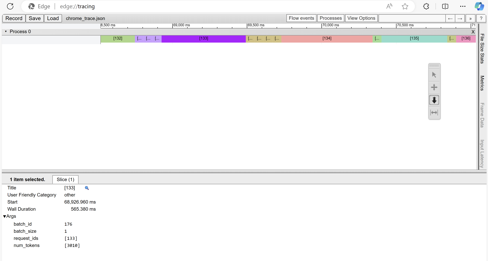

# Vidur: LLM Inference Simulator

Vidur is a high-fidelity and extensible LLM inference simulator. It can help you with:

1. Capacity planning and finding the best deployment configuration for your LLM deployments.
2. Test new research ideas like new scheduling algorithms, optimizations like speculative decoding, etc.
3. Study the system performance of models under different workloads and configurations.

... all without access to GPUs except for a quick initial profiling phase.

Please refer to our [MLSys'24 paper](https://arxiv.org/abs/2405.05465) for more details.
We have a [live demo](https://vidur.westus2.cloudapp.azure.com/) that captures the capabilities of the system.

## Supported Models

| Model / Device | A100 80GB DGX | H100 DGX | 4xA100 80GB Pairwise NVLink Node | 8xA40 Pairwise NVLink Node |
| --- | --- | --- | --- | --- |
| `meta-llama/Meta-Llama-3-8B` | ✅ | ❌ | ✅ | ❌ |
| `meta-llama/Meta-Llama-3-70B` | ✅ | ❌ | ✅ | ❌ |
| `meta-llama/Llama-2-7b-hf` | ✅ | ✅ | ✅ | ✅ |
| `codellama/CodeLlama-34b-Instruct-hf"` | ✅ | ✅ | ✅ | ✅ |
| `meta-llama/Llama-2-70b-hf` | ✅ | ✅ | ✅ | ✅ |
| `internlm/internlm-20b` | ✅ | ✅ | ✅ | ✅ |
| `Qwen/Qwen-72B` | ✅ | ✅ | ✅ | ✅ |

* __Instructions on adding a new model to existing or new SKUs can be found [here](docs/profiling.md)__.
* All models support a maximum context length of 4k except `Llama3-8B` and `Llama3-70B` which support 16k context length by passing additional CLI params:

```text
--sklearn_execution_time_predictor_prediction_max_prefill_chunk_size 16384 \
--sklearn_execution_time_predictor_prediction_max_batch_size 512 \
--sklearn_execution_time_predictor_prediction_max_tokens_per_request 16384 \
```

* Pipeline parallelism is supported for all models. The PP dimension should divide the number of layers in the model.
* In DGX nodes, there are 8 GPUs, fully connected via NVLink. So TP1, TP2, TP4 and TP8 are supported.
* In 4x pairwise NVLink nodes, there are 4 GPUs, so TP1, TP2 and TP4 are supported. TP4 here is less performant than TP4 in DGX nodes because (GPU1, GPU2) are connected via NVLink and (GPU3, GPU4) are connected via NVLink. but between these layers, the interconnect is slower.
* You can use any combination of TP and PP. For example, you can run LLaMA2-70B on TP2-PP2 on a 4xA100 80GB Pairwise NVLink Node.

## Chrome Trace

Vidur exports chrome traces of each simulation. The trace can be found in the `simulator_output` directory. The trace can be opened by navigating to `chrome://tracing/` or `edge://tracing/` and loading the trace.



## Setup

### Using `mamba`

To run the simulator, create a mamba environment with the given dependency file.

```sh
mamba env create -p ./env -f ./environment.yml
mamba env update -f environment-dev.yml
```

### Using `venv`

1. Ensure that you have Python 3.10 installed on your system. Refer <https://www.bitecode.dev/p/installing-python-the-bare-minimum>
2. `cd` into the repository root
3. Create a virtual environment using `venv` module using `python3.10 -m venv .venv`
4. Activate the virtual environment using `source .venv/bin/activate`
5. Install the dependencies using `python -m pip install -r requirements.txt`
6. Run `deactivate` to deactivate the virtual environment

### Using `conda` (Least recommended)

To run the simulator, create a conda environment with the given dependency file.

```sh
conda env create -p ./env -f ./environment.yml
conda env update -f environment-dev.yml
```

## Setting up wandb (Optional)

First, setup your account on `https://<your-org>.wandb.io/` or public wandb, obtain the api key and then run the following command,

```sh
wandb login --host https://<your-org>.wandb.io
```

To opt out of wandb, pick any one of the following methods:

1. `export WANDB_MODE=disabled` in your shell or add this in `~/.zshrc` or `~/.bashrc`. Remember to reload using `source ~/.zshrc`.
2. Set `wandb_project` and `wandb_group` as `""` in `vidur/config/default.yml`. Also, remove these CLI params from the shell command with which the simulator is invoked.

## Running the simulator

To run the simulator, execute the following command from the repository root,

```sh
python -m vidur.main
```

or a big example with all the parameters,

```sh
python -m vidur.main  \
--replica_device a100 \
--replica_model_name meta-llama/Llama-2-7b-hf  \
--cluster_num_replicas 1 \
--replica_num_tensor_parallel_workers 1 \
--replica_num_pipeline_stages 1 \
--request_generator_provider synthetic \
--synthetic_request_generator_length_provider trace \
--synthetic_request_generator_interval_provider static \
--request_generator_max_tokens 4096 \
--trace_request_length_generator_trace_file ./data/processed_traces/arxiv_summarization_stats_llama2_tokenizer_filtered_v2.csv \
--synthetic_request_generator_num_requests 128  \
--request_generator_provider synthetic \
--synthetic_request_generator_length_provider trace \
--synthetic_request_generator_interval_provider static \
--request_generator_max_tokens 4096 \
--trace_request_length_generator_trace_file ./data/processed_traces/arxiv_summarization_stats_llama2_tokenizer_filtered_v2.csv \
--synthetic_request_generator_num_requests 128  \
--replica_scheduler_provider vllm  \
--replica_scheduler_batch_size_cap 256  \
--vllm_scheduler_max_tokens_in_batch 4096
```

The simulator supports a plethora of parameters for the simulation description which can be found [here](docs/launch_parameters.md).

The metrics will be logged to wandb directly and a copy will be stored in the `simulator_output` directory along with the chrome trace. A description of all the logged metrics can be found [here](docs/metrics.md).

## Formatting Code

To format code, execute the following command:

```sh
make format
```

## Contributing

This project welcomes contributions and suggestions.  Most contributions require you to agree to a
Contributor License Agreement (CLA) declaring that you have the right to, and actually do, grant us
the rights to use your contribution. For details, visit https://cla.opensource.microsoft.com.

When you submit a pull request, a CLA bot will automatically determine whether you need to provide
a CLA and decorate the PR appropriately (e.g., status check, comment). Simply follow the instructions
provided by the bot. You will only need to do this once across all repos using our CLA.

This project has adopted the [Microsoft Open Source Code of Conduct](https://opensource.microsoft.com/codeofconduct/).
For more information see the [Code of Conduct FAQ](https://opensource.microsoft.com/codeofconduct/faq/) or
contact [opencode@microsoft.com](mailto:opencode@microsoft.com) with any additional questions or comments.

## Trademarks

This project may contain trademarks or logos for projects, products, or services. Authorized use of Microsoft 
trademarks or logos is subject to and must follow 
[Microsoft's Trademark & Brand Guidelines](https://www.microsoft.com/en-us/legal/intellectualproperty/trademarks/usage/general).
Use of Microsoft trademarks or logos in modified versions of this project must not cause confusion or imply Microsoft sponsorship.
Any use of third-party trademarks or logos are subject to those third-party's policies.
